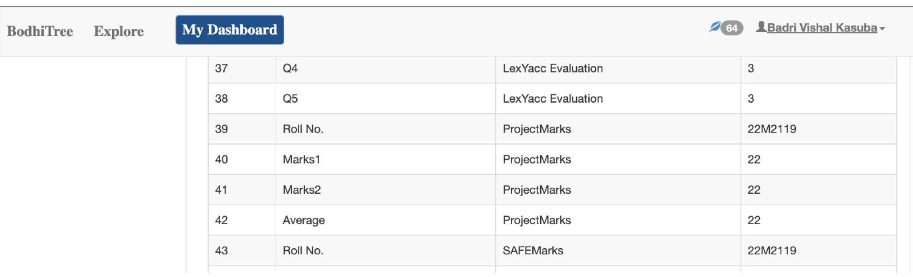

# Python Space Adventure Game with Multiple modes and Levels

As Part of Course project of Software Lab (CS 699) developed a pygame.

Very easy to install and very easy to run the game. Just run the make file and it will do everything for you

## Running installations

```
make
```

### Game Images


## Team Details

| Name | Roll No | Email |
|------|---------|-------|
| Badri Vishal Kasuba | 22M2119 | badrivishalk@cse.iitb.ac.in |
| Aditya Pande | 22M2108 | pingpongpande@cse.iitb.ac.in |

## Achievements

Received 22/20 in the course project


